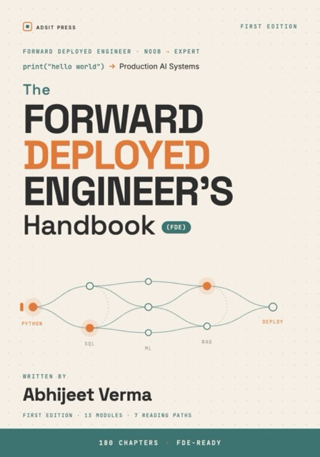

# The Forward Deployed Engineer's Handbook — Companion Code



   

This repository contains the **runnable portfolio codebase** for
*The Forward Deployed Engineer's Handbook* by Abhijeet Verma — 180 chapters
that take you from `print("hello world")` to deploying, evaluating, and
handing over production AI systems.

Everything in the book is built against **one realistic streaming company,
CinemaStream** — the same datasets, the same characters, the same growing
codebase from chapter 000 to the capstones. This repo *is* that codebase:
data pipelines, SQL, ML models, a multilingual RAG assistant, a Streamlit
dashboard, dbt, Airflow, Kubernetes manifests, a client-engagement project
(`filmibox/`), and the verification harness that keeps it all honest.

> **Code, datasets, and configuration only.** The book's text is sold
> separately — get it at **[adsit.work/fde-handbook](https://adsit.work/fde-handbook)**.

<br clear="right"/>

## Quickstart

```bash
git clone https://github.com/MaqAnquor/fde-handbook-code.git
cd fde-handbook-code
python3 -m venv .venv && source .venv/bin/activate     # Windows: .venv\Scripts\activate
pip install -r requirements.txt --use-deprecated=legacy-resolver
```

The `--use-deprecated=legacy-resolver` flag is **required** — the pinned
dependency set contains deliberately co-pinned packages that strict resolvers
refuse. [RUNNING_THE_CODE.md](RUNNING_THE_CODE.md) explains exactly why, pin
by pin, plus platform specifics (macOS/MPS, Windows, newer NVIDIA GPUs).

**No local install?** Every notebook runs on Google Colab (free GPU for the
deep-learning parts) — see [COLAB_SETUP.md](COLAB_SETUP.md).

Datasets live in `cinemastream/data/*.csv`. Code imports as the
`cinemastream` package — run commands from the repo root.

## The notebooks — one per part of the book

The 13 notebooks contain every code block from the book, in reading order,
ready to run top-to-bottom. (The teaching text, diagrams, and illustrations
live in the book; the notebooks carry the runnable code with section
navigation.)

| # | Book part | Chapters | Notebook |
|---|---|---|---|
| 0A | Absolute Foundations — Python basics, no prior coding assumed | 000–015 | [part_00](notebooks/part_00_absolute_foundations_python_basics_no_prior_coding_assumed.ipynb) |
| 0B | Essential BAU Tools — git, environments, APIs, Docker | 016–021a | [part_01](notebooks/part_01_essential_bau_tools.ipynb) |
| 1 | NumPy & Pandas | 022–031 | [part_02](notebooks/part_02_numpy_pandas.ipynb) |
| 2 | SQL Basics to Advanced | 032–041a | [part_03](notebooks/part_03_sql_basics_to_advanced.ipynb) |
| 3 | The FDE Mindset — pipelines, data quality, ETL vs ELT | 042–045 | [part_04](notebooks/part_04_fde_mindset.ipynb) |
| 4 | Advanced SQL & Data Modeling — Airflow, star schema, dbt, warehouses | 046–051a | [part_05](notebooks/part_05_advanced_sql_data_modeling.ipynb) |
| 5 | ETL/ELT, Orchestration, Data Quality — observability, contracts, CDC, FinOps | 052–059 | [part_06](notebooks/part_06_etl_elt_orchestration_data_quality.ipynb) |
| 6 | Prototyping & Prompt Engineering — Streamlit, RAG, LLM workflows, math for ML | 060–066c | [part_07](notebooks/part_07_prototyping_prompt_engineering.ipynb) |
| 7 | Applied ML for Deployment — churn model, metrics, tuning, serving, foundation models | 067–077c | [part_08](notebooks/part_08_applied_ml_for_deployment.ipynb) |
| 8 | Deep Learning — neural nets to transformers, RAG at depth, the AI harness | 078–085k | [part_09](notebooks/part_09_deep_learning.ipynb) |
| 9 | Client Deployment & Consulting — the FilmiBox engagement | 086–092 | [part_10](notebooks/part_10_client_deployment_consulting_fde_module.ipynb) |
| 10 | Capstones — Data Hub, production assistant, legacy migration, harness | 093–095 | [part_11](notebooks/part_11_capstone.ipynb) |
| 11 | Tool Mastery — self-contained deep-dive reference, 37 libraries | 096–132 | [part_12](notebooks/part_12_tool_mastery_deep_dive_library_reference_noob_master_self_contained.ipynb) |

## What's inside the portfolio

| Path | What it is | Built in |
|---|---|---|
| `cinemastream/data/` | The six canonical datasets (movies, users, watch events, ratings, subscriptions, tickets) | Ch 023+ |
| `cinemastream/scripts/` | Data loading, currency API client, synthetic data generation, plot style | Ch 014–024a |
| `cinemastream/sql/` | Schemas and analytical queries | Ch 032+ |
| `cinemastream/pipelines/` | Airflow DAGs (`watch_events_dag.py`) | Ch 046–047 |
| `cinemastream/dbt_cinemastream/` | dbt project — staging, marts, tests | Ch 049 |
| `cinemastream/ml/churn/` | Churn model: training, tuning, FastAPI serving | Ch 067–077 |
| `cinemastream/ml/content_tagging/` | Content tagging + the multilingual movie-RAG pipeline | Ch 078–085 |
| `cinemastream/streamlit_app/` | The internal dashboard | Ch 060+ |
| `cinemastream/data_hub/` | Capstone: multi-source query layer with readiness gate | Ch 093 |
| `cinemastream/harness/` | The verification harness — gates, evals, cost controls | Ch 085e–093c |
| `cinemastream/k8s/` | Kubernetes manifests | Ch 021a |
| `cinemastream/tests/` | Test suite | Ch 018a+ |
| `filmibox/` | **The client engagement** — discovery, prioritization, scope, demo, migration, and the production assistant built as an FDE consultant in Ch 086–093b | Ch 086+ |

## Reproducibility — the part most books skip

The book prints the **real output** of its code, and treats that as a
contract: hundreds of code blocks across the deterministic core are
re-executed in a pinned environment and compared against the book's printed
`Output:` blocks before any release. That is why the dependency versions are
exact and the install flag is non-negotiable — your run in 2027 should match
the book's page. Chapters whose output is inherently machine-dependent
(GPU training, LLM inference, timings) are marked as representative in the
text. The pin-by-pin rationale is in
[RUNNING_THE_CODE.md](RUNNING_THE_CODE.md).

## Prerequisites & hardware

The book assumes **no prior coding** at chapter 000 and builds everything it
uses. The code runs on an ordinary laptop (macOS, Windows, or Linux); the
deep-learning chapters run on CPU, faster with any GPU, and every
GPU-dependent notebook has a free-Colab path. Newer NVIDIA cards
(RTX 50-series): see the `cu128` wheel note in
[RUNNING_THE_CODE.md](RUNNING_THE_CODE.md).

## Get the book

**[adsit.work/fde-handbook](https://adsit.work/fde-handbook)** — EPUB + PDF
bundle, DRM-free. 180 chapters · 13 modules · 7 reading paths · this
portfolio as the running thread.

## Questions & feedback

Open a [GitHub issue](../../issues) for anything that doesn't run as the book
says it should — reproducibility reports are especially welcome (include OS,
Python version, and the chapter number).

## Citation

```bibtex
@book{verma2026fde,
  author    = {Abhijeet Verma},
  title     = {The Forward Deployed Engineer's Handbook: From Python to Production AI Systems},
  publisher = {Adsit Press},
  year      = {2026},
  isbn      = {978-81-688506-0-6}
}
```

## License

See [LICENSE.txt](LICENSE.txt). You may use and adapt this code in your own
private or commercial projects; you may **not** repackage or resell it as a
competing educational product, course, or book.

---
*Published by Adsit Press · © 2026 Abhijeet Verma*
